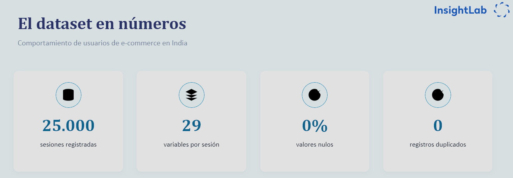
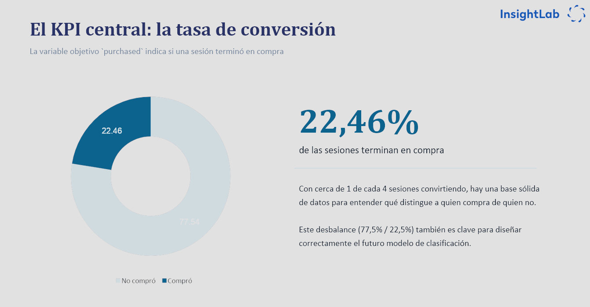
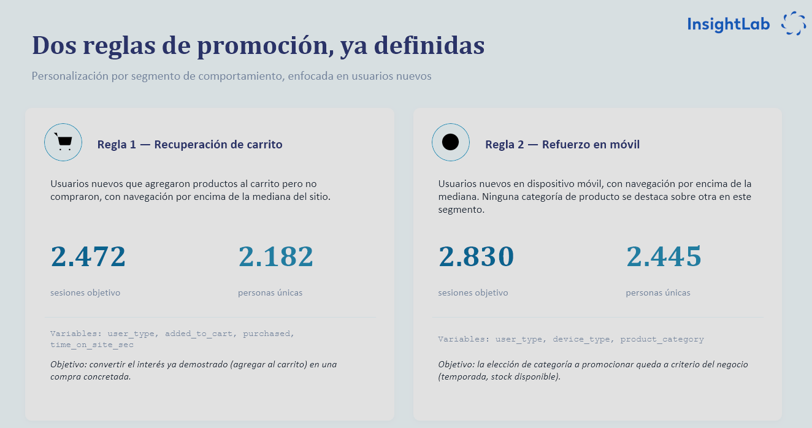
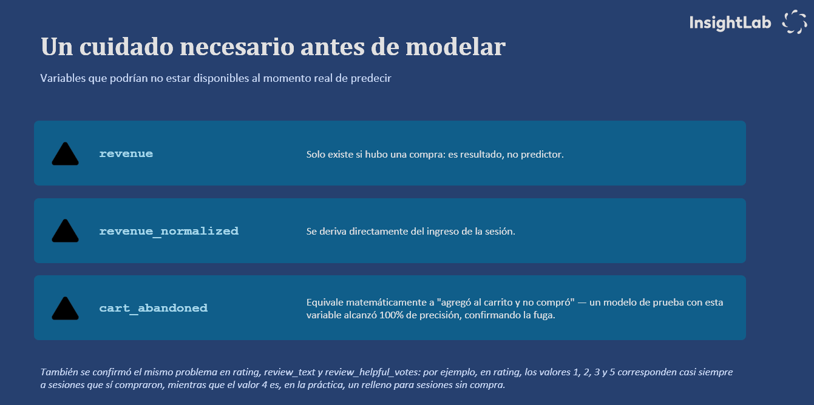
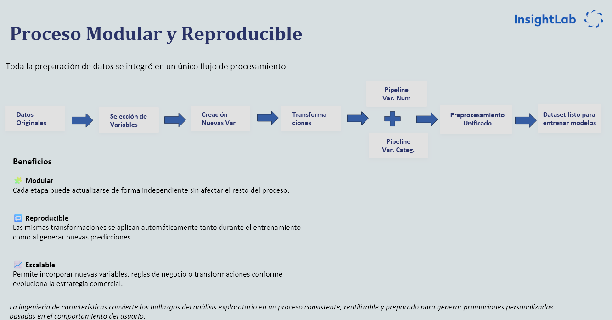
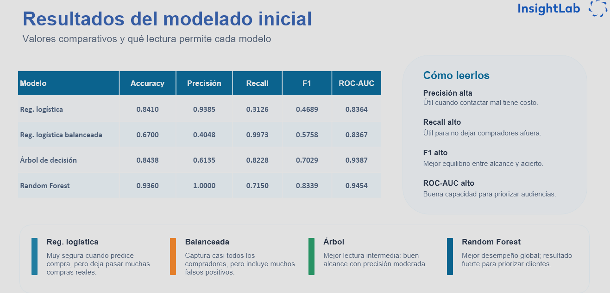

# Documentación - Proyecto de Recomendación InsightLab

## Descripción general

Este avance documenta los componentes del flujo de trabajo del proyecto de recomendación y predicción de compra para un entorno e-commerce. El objetivo principal es preparar una base sólida para el análisis exploratorio, la ingeniería de características y el entrenamiento de modelos supervisados orientados a predecir la variable `purchased`, sobre una base de 25.000 sesiones de usuarios de e-commerce en India.

Los archivos documentados son:

```text
cargar_datos.py
analisis_exploratorio.ipynb
ft_engineering.py
model_training.py
association_rules.py
```

---

## `cargar_datos.py`

### Objetivo del archivo

El archivo `cargar_datos.py` centraliza la carga del dataset principal del proyecto. Su función es separar la lectura de datos del resto del flujo de análisis y modelado, evitando repetir código en notebooks o scripts posteriores.

Este archivo permite cargar la base `Ecommerce.csv` desde la estructura del proyecto y realizar una primera validación básica de su contenido.

### Funcionamiento general

El script define una función genérica llamada `cargar_csv(nombre_archivo)`, que recibe el nombre del archivo CSV a cargar. A partir de la ubicación del propio script, construye la ruta hacia la raíz del proyecto y busca allí el archivo indicado.

Antes de cargar los datos, el script valida que el archivo exista. Si no lo encuentra, genera un error claro mediante `FileNotFoundError`, indicando la ruta donde esperaba encontrarlo. Esto ayuda a detectar rápidamente problemas de ubicación del dataset o cambios en la estructura de carpetas.

Una vez encontrado el archivo, se carga mediante `pandas.read_csv()` y se imprimen tres datos básicos:

```text
Nombre del archivo cargado
Cantidad de filas
Cantidad de columnas
```

### Función principal

La función `cargar_datos()` utiliza internamente `cargar_csv()` para cargar específicamente el archivo:

```text
Ecommerce.csv
```

De esta forma, el resto del proyecto puede importar y usar directamente `cargar_datos()` sin preocuparse por la ruta del archivo ni por la lógica de lectura.


### Ejecución directa

Cuando el archivo se ejecuta directamente, realiza una revisión inicial del dataset mostrando:

```text
Primeras filas del dataset
Información general de columnas y tipos de datos
Cantidad de valores nulos por columna
```

Esto permite validar rápidamente que el dataset fue cargado correctamente antes de avanzar con el análisis exploratorio o la ingeniería de características.

---

## `analisis_exploratorio.ipynb`

### Objetivo del notebook

El notebook `analisis_exploratorio.ipynb` desarrolla el análisis exploratorio inicial del dataset de comportamiento de usuarios de e-commerce. Su objetivo es comprender la estructura de los datos, revisar su calidad y detectar patrones relevantes asociados a la conversión, el carrito, la navegación y las posibles estrategias de promoción.

### Revisión inicial del dataset

En primer lugar, se realiza una exploración general de la base, revisando cantidad de filas y columnas, primeras observaciones, tipos de datos, valores nulos y duplicados. Esta etapa permite validar si el dataset se encuentra en condiciones adecuadas para avanzar hacia el modelado.

En la revisión realizada, el dataset no presenta valores nulos que requieran imputación. Esto puede deberse a que proviene de registros automáticos de una plataforma e-commerce o a que ya atravesó un proceso previo de limpieza y corrección. Variables como páginas vistas, tiempo en el sitio, compras, descuentos e ingresos suelen capturarse directamente desde eventos del sistema, reduciendo errores de carga manual. Además, valores como `0` en ingresos o abandono representan situaciones válidas del negocio, no datos faltantes.





### Análisis de variables

El análisis exploratorio contempla variables numéricas, categóricas y binarias. Para las variables numéricas se revisan estadísticas descriptivas, rangos, posibles valores extremos y distribuciones. Para las variables categóricas o codificadas numéricamente, se analiza la frecuencia de cada categoría y su posible relación con la variable objetivo.

Entre las variables relevantes para el análisis se encuentran:

```text
device_type
user_type
marketing_channel
product_category
unit_price
quantity
discount_percent
discount_amount
pages_viewed
time_on_site_sec
added_to_cart
payment_method
visit_season
visit_day
visit_month
session_duration_bucket
location
purchased
```

### Análisis de la variable objetivo

La variable objetivo del proyecto es:

```text
purchased
```

Esta variable indica si una sesión terminó o no en compra. Durante el análisis exploratorio se revisa su distribución para comprender la proporción de sesiones con compra y sin compra. Esta revisión es importante porque permite detectar si existe desbalance de clases y anticipar posibles decisiones de modelado.





### Revisión de consistencia lógica

También se revisa la coherencia entre variables relacionadas con el flujo de compra, especialmente aquellas asociadas al carrito, la compra y el abandono. Este tipo de validación permite detectar reglas de negocio inconsistentes, como compras sin carrito previo o sesiones marcadas simultáneamente como compra y abandono.

### Posible fuga de información

Durante el análisis se identifican variables que podrían representar fuga de información para un modelo de predicción de compra. Esto ocurre cuando una variable contiene información que, en un escenario real, solo se conocería después de que la compra ocurrió o no ocurrió.

Variables como las siguientes deben analizarse con cuidado antes de ser utilizadas en el entrenamiento:

```text
cart_abandoned
revenue
revenue_normalized
rating
review_text
review_helpful_votes
```

Por ejemplo, `cart_abandoned` puede depender directamente de saber si el usuario finalmente compró o no. De forma similar, `revenue` suele conocerse después de la compra, por lo que incluirla en un modelo predictivo podría generar resultados artificialmente altos y poco realistas.

### Conclusión del EDA

El análisis exploratorio permite concluir que el dataset se encuentra en buen estado para continuar con la preparación de variables. No se detectan problemas graves de duplicados, nulos o inconsistencias estructurales. La principal decisión técnica no está relacionada con imputación, sino con la selección cuidadosa de variables para evitar fuga de información y construir un modelo aplicable a un escenario real de predicción.

---

## `ft_engineering.py`

### Objetivo del archivo

El archivo `ft_engineering.py` implementa el proceso de ingeniería de características y preprocesamiento de datos previo al entrenamiento de los modelos supervisados. Su propósito es transformar el conjunto de datos original en matrices de entrenamiento y prueba listas para la modelación, incorporando nuevas variables de negocio, seleccionando las características relevantes y aplicando un flujo de transformaciones reproducible mediante *pipelines*.

---

### Funcionamiento general

El script define una función principal denominada `ft_engineering()`, la cual ejecuta de forma secuencial el proceso de preparación de datos para el modelo.

El flujo desarrollado comprende las siguientes etapas:

1. **Carga del dataset** mediante la función `cargar_datos()`.
2. **Generación de nuevas características**, orientadas a representar patrones de navegación e intención de compra de los usuarios.
3. **Selección de las variables** utilizadas durante la etapa de modelación.
4. **Separación de variables predictoras (`X`) y variable objetivo (`y`)**.
5. **División del conjunto de datos** en entrenamiento (80 %) y prueba (20 %), manteniendo la distribución de la variable objetivo mediante muestreo estratificado.
6. **Construcción del pipeline de preprocesamiento**, donde se aplican las transformaciones necesarias sobre las variables.
7. **Aplicación del preprocesamiento** sobre los conjuntos de entrenamiento y prueba.
8. **Retorno de los datos procesados**, junto con el objeto `preprocessor`, el cual será reutilizado posteriormente durante la etapa de despliegue para garantizar consistencia entre entrenamiento e inferencia.

---

### Función principal

#### `ft_engineering()`

Realiza la preparación integral del conjunto de datos para el entrenamiento de modelos de clasificación.

Las principales actividades desarrolladas por la función son:

#### 1. Carga de datos

Obtiene el conjunto de datos procesado mediante la función `cargar_datos()`.

#### 2. Ingeniería de características

Se genera una nueva variable de comportamiento:

- **`tiempo_por_pagina`**: calcula el tiempo promedio dedicado por el usuario a cada página visitada, permitiendo medir la intensidad de navegación.
- **`visit_month`, `visit_weekday`, `visit_season`**: variables derivadas de `visit_date`, que capturan patrones de estacionalidad y comportamiento semanal en la navegación.

Adicionalmente, se definen dos **reglas de negocio** (no variables de modelado):

- **`promocion_1`**: identifica usuarios nuevos que agregaron productos al carrito, permanecieron un tiempo superior a la mediana del sitio y no finalizaron la compra. Al depender de `purchased` en su propia fórmula, no puede usarse como input del modelo (fuga de información).
- **`promocion_2`**: identifica usuarios nuevos que navegan desde dispositivos móviles y presentan tiempos de navegación superiores a la mediana. Aunque no depende de `purchased`, es una combinación de variables ya existentes en el dataset (`user_type`, `device_type`, `time_on_site_sec`), por lo que tampoco se incluye como input: representa la regla de negocio a aplicar sobre los resultados del modelo, no un dato de comportamiento nuevo. 
La elección de **qué categoría de producto** promocionar dentro de este segmento queda a criterio del negocio (por ejemplo, según temporada o stock disponible), y no forma parte de la fórmula que determina la pertenencia al segmento.

Ambas reglas se calculan y documentan en esta etapa, pero se excluyen explícitamente en la selección de variables del paso siguiente.





#### 3. Selección de variables

Se seleccionan únicamente las variables que aportan información relevante para la predicción de la variable objetivo (`purchased`), eliminando variables redundantes o con fuga de información previamente identificadas durante el análisis exploratorio.





#### 4. División del dataset

El conjunto de datos se divide en:

- Variables predictoras (`X`)
- Variable objetivo (`y`)

Posteriormente se realiza la separación en conjuntos de entrenamiento y prueba utilizando una partición del **80 % - 20 %**, manteniendo la proporción de ambas clases mediante muestreo estratificado.


#### 5. Preprocesamiento

Se construye un flujo de transformación utilizando `ColumnTransformer`, compuesto por:

- **Pipeline numérico**
  - Estandarización de las variables mediante `StandardScaler`.

- **Pipeline de transformación logarítmica**
  - Aplicación de `log1p` sobre la variable `discount_amount` para reducir la asimetría ocasionada por valores extremos.

- **Pipeline categórico**
  - Codificación de las variables categóricas mediante `OneHotEncoder`, permitiendo representarlas correctamente para el modelo.

Finalmente, el preprocesador es ajustado sobre los datos de entrenamiento y posteriormente aplicado al conjunto de prueba.

##### Nota sobre variables temporales

A partir de `visit_date` se generan las variables derivadas `visit_month`, `visit_weekday` y `visit_season`. `visit_date` se conserva también en el dataset, transformada a un valor ordinal (`pd.Timestamp.toordinal`) para poder ser utilizada por modelos numéricos.

Mantener las cuatro variables temporales, aun existiendo cierta redundancia entre ellas, no representa un problema dado el tamaño acotado del dataset (25.000 sesiones): los modelos basados en árboles pueden identificar y descartar por sí mismos las variables que no aporten información relevante.

#### 6. Valor retornado

La función retorna:

| Variable | Descripción |
|----------|-------------|
| `X_train_processed` | Variables predictoras de entrenamiento preprocesadas. |
| `X_test_processed` | Variables predictoras de prueba preprocesadas. |
| `y_train` | Variable objetivo para entrenamiento. |
| `y_test` | Variable objetivo para prueba. |
| `preprocessor` | Pipeline completo de preprocesamiento utilizado durante entrenamiento e inferencia. |

---

### Ejecución directa

Este archivo funciona como un módulo de preprocesamiento dentro del flujo de entrenamiento del proyecto y no está diseñado para ejecutarse de forma independiente.

La función `ft_engineering()` es invocada desde el módulo `model_training.py`, donde los datos procesados son utilizados para entrenar y evaluar los diferentes modelos de clasificación implementados en el proyecto.





---

## `model_training.py`

### Objetivo del archivo

El archivo `model_training.py` entrena y compara distintos modelos de clasificación para predecir la variable `purchased`, utilizando los datos preprocesados por `ft_engineering()`.

### Modelos entrenados

Se entrenan y evalúan cuatro modelos de clasificación con las métricas Accuracy, Precision, Recall, F1-score y ROC-AUC, además de matriz de confusión y reporte de clasificación completo:

- **Regresión Logística** (`max_iter=1000`)
- **Regresión Logística Balanceada** (`class_weight="balanced"`, para compensar el desbalance de clases)
- **Árbol de Decisión** (`max_depth=6`, `min_samples_split=20`, `min_samples_leaf=10`, `class_weight="balanced"`)
- **Random Forest** (`n_estimators=200`, `class_weight="balanced"`)





### Búsqueda de hiperparámetros con XGBoost

Se entrena adicionalmente un modelo **XGBoost** mediante `GridSearchCV`, con validación cruzada estratificada de 5 folds (`StratifiedKFold`) y optimización sobre `roc_auc`. Los hiperparámetros explorados incluyen número de estimadores, tasa de aprendizaje, profundidad máxima y regularización (`reg_alpha`, `reg_lambda`).

A diferencia de los cuatro modelos anteriores, este XGBoost no se utiliza como candidato final de clasificación, sino para obtener la **importancia de variables** (`feature_importances_`) a partir de los nombres generados por el `preprocessor`. Este ranking de variables es el insumo para la etapa de clustering.


> **Nota:** el registro de corridas en MLflow todavía no está implementado en este script. El guardado de los modelos entrenados (serialización a `.pkl`) se documenta más abajo, en la sección "Extracción y almacenamiento de modelos entrenados".


### Ejecución directa

El script se ejecuta directamente (`python model_training.py`) e imprime en consola, para cada modelo, sus métricas, matriz de confusión y reporte de clasificación, junto con el ranking de importancia de variables del XGBoost.

---

## Automatización con GitHub Actions

Para automatizar la validación del proyecto y reducir errores antes de integrar cambios en la rama principal, se implementaron workflows utilizando GitHub Actions.

Los workflows se encuentran en:

```text
.github/
└── workflows/
    ├── validation.yml
    └── training.yml
```

La automatización sigue el flujo de trabajo del repositorio:

```text
develop
   ↓
certification
   ↓
Pull Request
   ↓
main
```

### Evolución de los workflows

Inicialmente, toda la validación del proyecto se realizaba mediante un único workflow. Este workflow verificaba la sintaxis, las dependencias y ejecutaba los principales procesos del proyecto, incluyendo el entrenamiento de los modelos.

Sin embargo, el entrenamiento es un proceso más costoso y específico que las validaciones generales del código. Por este motivo, se decidió separar las responsabilidades en dos workflows:

- `validation.yml`: validaciones generales y procesos básicos del proyecto.
- `training.yml`: ejecución del entrenamiento cuando los cambios pueden afectar directamente a los modelos.

Esta separación permite evitar que el entrenamiento se ejecute innecesariamente ante modificaciones que no afectan al modelado, como cambios en la documentación o en otros componentes del proyecto.

### Workflow de validación (`validation.yml`)

El workflow `validation.yml` realiza las validaciones generales del proyecto.

Se ejecuta automáticamente en los siguientes casos:

- Cuando se realiza un `push` a la rama `certification`.
- Cuando se realiza un `push` a la rama `main`.
- Cuando se crea o actualiza un Pull Request hacia `main`.

El workflow realiza las siguientes tareas:

1. Descarga el repositorio.
2. Configura Python 3.11.
3. Instala las dependencias definidas en `requirements.txt`.
4. Verifica la sintaxis de los scripts Python mediante `compileall`.
5. Comprueba que las principales dependencias del proyecto puedan importarse correctamente.
6. Ejecuta el proceso de carga de datos.
7. Ejecuta el pipeline de Feature Engineering.

La estructura general del proceso es:

```text
Push / Pull Request
        ↓
Descarga del repositorio
        ↓
Configuración de Python 3.11
        ↓
Instalación de dependencias
        ↓
Verificación de sintaxis
        ↓
Verificación de imports
        ↓
Carga de datos
        ↓
Feature Engineering
```

#### Verificación de sintaxis

Se utiliza:

```bash
python -m compileall src
```

Este comando compila los archivos Python del directorio `src` para comprobar que no existan errores de sintaxis.

Esta validación permite detectar errores como:

- Errores de indentación.
- Paréntesis o corchetes sin cerrar.
- Errores de sintaxis en el código.
- Estructuras Python inválidas.

#### Verificación de dependencias

También se comprueba que las principales librerías utilizadas por el proyecto puedan importarse correctamente, entre ellas:

- pandas.
- numpy.
- scipy.
- scikit-learn.
- matplotlib.
- seaborn.
- XGBoost.
- CatBoost.
- FastAPI.
- Uvicorn.
- Streamlit.
- mlxtend

Esto permite detectar problemas relacionados con dependencias faltantes, incompatibilidades o errores en la instalación del entorno.

#### Ejecución de carga de datos

Se ejecuta:

```bash
python src/cargar_datos.py
```

Esto permite comprobar que el proceso de carga del dataset funcione correctamente dentro del entorno de GitHub Actions.

#### Ejecución de Feature Engineering

El pipeline de transformación de variables también se ejecuta para verificar que:

- Los datos puedan procesarse.
- Las transformaciones funcionen.
- El preprocesador pueda construirse.
- Las variables necesarias para el modelado puedan generarse correctamente.

### Workflow de entrenamiento (`training.yml`)

El workflow `training.yml` se creó para separar el entrenamiento de modelos de las validaciones generales.

Actualmente se ejecuta únicamente cuando se realiza un Pull Request hacia `main` y el cambio incluye modificaciones en alguno de los archivos directamente relacionados con el proceso de modelado:

```text
MLOps-InsightLab/src/model_training.py
MLOps-InsightLab/src/ft_engineering.py
```

La configuración utiliza filtros de rutas (`paths`) para evitar ejecuciones innecesarias.

Por lo tanto, el entrenamiento se ejecuta cuando:

```text
Pull Request → main
        ↓
Se modificó model_training.py
        ↓
Entrenamiento de modelos
```

o:

```text
Pull Request → main
        ↓
Se modificó ft_engineering.py
        ↓
Entrenamiento de modelos
```

En cambio, no se ejecuta si el Pull Request únicamente modifica archivos que no afectan al modelado, como:

- `README.md`.
- Documentación.
- Archivos de presentación.
- Otros componentes no relacionados con el entrenamiento.

#### Proceso de entrenamiento

El workflow realiza las siguientes tareas:

1. Descarga el repositorio.
2. Configura Python 3.11.
3. Instala las dependencias del proyecto.
4. Ejecuta:

```bash
python src/model_training.py
```

El entrenamiento se considera exitoso únicamente si el script finaliza correctamente.

Si ocurre un error durante el entrenamiento:

```text
Error en model_training.py
        ↓
Workflow fallido
        ↓
Pull Request marcado como fallido
        ↓
El problema debe corregirse antes de integrar los cambios
```

Esto permite utilizar el entrenamiento como una validación automática de los cambios que pueden afectar directamente al modelo.

### Flujo de validación de un Pull Request

Cuando se realiza un Pull Request desde `certification` hacia `main`, los workflows se ejecutan según los archivos modificados.

#### Cambio en la documentación

```text
Modificación de README.md
        ↓
Pull Request → main
        ↓
validation.yml
```

El entrenamiento no se ejecuta porque el cambio no afecta al modelo.

#### Cambio en `model_training.py`

```text
Modificación de model_training.py
        ↓
Pull Request → main
        ↓
validation.yml
        ↓
training.yml
```

En este caso se ejecutan ambos workflows:

- `validation.yml` verifica la integridad general del proyecto.
- `training.yml` verifica que los modelos puedan entrenarse correctamente.

#### Cambio en `ft_engineering.py`

```text
Modificación de ft_engineering.py
        ↓
Pull Request → main
        ↓
validation.yml
        ↓
training.yml
```

El entrenamiento también se ejecuta porque los cambios en Feature Engineering pueden modificar las variables de entrada del modelo y afectar el proceso de entrenamiento.

### Objetivo de la separación

La separación entre ambos workflows permite aplicar una validación más eficiente:

```text
Cambios generales
        ↓
validation.yml
```

```text
Cambios que afectan al modelado
        ↓
validation.yml
        +
training.yml
```

De esta forma, el proyecto mantiene un proceso de integración controlado sin ejecutar innecesariamente procesos computacionalmente costosos.

La lógica adoptada es:

> Todo cambio debe pasar las validaciones generales del proyecto. Los cambios que pueden afectar directamente al entrenamiento de los modelos deben superar, además, una validación específica del proceso de entrenamiento antes de integrarse en `main`.

### Beneficios de la automatización

La implementación de GitHub Actions aporta:

- Detección temprana de errores.
- Validación automática de la sintaxis del código.
- Comprobación de dependencias.
- Validación de la carga y transformación de datos.
- Verificación automática del entrenamiento de modelos.
- Reducción de errores manuales.
- Mayor reproducibilidad del entorno.
- Protección de la rama `main` frente a cambios que no puedan ejecutarse correctamente.

La automatización forma parte del pipeline MLOps del proyecto y constituye la base para futuras mejoras, como la incorporación de seguimiento de experimentos con MLflow, almacenamiento de artefactos de modelos, despliegue automatizado y monitoreo continuo.


## Problemas con el historial de ramas y solución

Durante la evolución del proyecto se presentó un problema relacionado con la historia de commits de las ramas principales del repositorio.

El flujo de trabajo definido para el proyecto era:

```text
develop → certification → main
```

La idea era que los cambios se desarrollaran inicialmente en `develop`, luego fueran revisados y validados en `certification` y, finalmente, se incorporaran a `main`.

Sin embargo, al intentar crear un Pull Request desde `develop` hacia `certification`, GitHub mostraba el siguiente mensaje:

```text
There isn't anything to compare.
certification and develop are entirely different commit histories.
```

### Causa del problema

El problema no estaba relacionado con el contenido de los archivos, sino con el historial de Git.

Las ramas `develop` y `certification` habían sido creadas a partir de historias diferentes y no compartían un commit ancestro común.

Aunque ambas ramas podían contener archivos relacionados con el mismo proyecto, desde el punto de vista de Git pertenecían a dos historias completamente independientes.

Por esta razón, GitHub no podía calcular correctamente qué cambios de `develop` debían compararse con `certification` para generar un Pull Request.

El mensaje:

```text
entirely different commit histories
```

indica precisamente que las ramas no tienen una historia común.

---

### Solución aplicada

Para solucionar el problema se decidió unificar las historias de ambas ramas mediante un merge explícito.

Primero se actualizó la información local del repositorio:

```bash
git fetch origin
```

Luego se cambió a la rama `develop` y se actualizaron sus cambios:

```bash
git checkout develop
git pull origin develop
```

Posteriormente se fusionó la rama `certification` dentro de `develop`, permitiendo explícitamente la combinación de historias independientes:

```bash
git merge origin/certification --allow-unrelated-histories
```

La opción:

```text
--allow-unrelated-histories
```

fue necesaria porque Git detectaba que ambas ramas no tenían un ancestro común.

Después del merge, si aparecían conflictos, se resolvían manualmente y se confirmaban los cambios:

```bash
git add .
git commit
```

Finalmente, se actualizó la rama remota:

```bash
git push origin develop
```

---

### Resultado

Después de realizar la unión de las historias, las ramas pasaron a compartir una historia común.

A partir de ese momento, GitHub pudo comparar correctamente las ramas y generar Pull Requests entre ellas.

El flujo de integración quedó estructurado de la siguiente manera:

```text
develop
   │
   │ Pull Request
   ▼
certification
   │
   │ Pull Request
   ▼
main
```

---

### Importancia de mantener una historia común

Este problema demuestra la importancia de que las ramas de un mismo flujo de desarrollo se creen a partir de una historia común.

Para evitar situaciones similares, las nuevas ramas deben crearse a partir de una rama existente del repositorio:

```bash
git checkout develop
git pull origin develop
git checkout -b nueva-rama
```

De esta manera, la nueva rama comparte automáticamente la historia de `develop` y Git puede comparar sus cambios mediante Pull Requests.

Por ejemplo:

```text
main
 │
 └── certification
       │
       └── develop
```

o, según el flujo de trabajo:

```text
main
 │
 └── certification
       │
       └── feature/nueva-funcionalidad
```

La creación de ramas a partir de una base común permite que Git pueda:

* Comparar los cambios entre ramas.
* Detectar modificaciones comunes.
* Generar Pull Requests.
* Resolver merges de forma más predecible.
* Mantener una trazabilidad clara del desarrollo.

---

### Consideración sobre el flujo del proyecto

La solución aplicada permitió continuar utilizando el flujo definido:

```text
develop → certification → main
```

Sin embargo, la principal lección obtenida fue que el flujo de ramas debe establecerse desde el inicio del proyecto.

Las ramas que participan en un mismo proceso de integración deben mantener una historia Git relacionada. Si se crean de forma independiente, puede ser necesario realizar una unión manual de historias mediante:

```bash
git merge --allow-unrelated-histories
```

Esta opción debe utilizarse de forma consciente, ya que puede generar conflictos cuando ambas historias contienen archivos con nombres y estructuras similares.

---

## Extracción y almacenamiento de modelos entrenados

Como parte de la evolución del proyecto, se modificó el proceso de entrenamiento para guardar los modelos entrenados como archivos serializados con extensión:

```text
.pkl
```

El objetivo fue separar el proceso de entrenamiento del uso posterior de los modelos. De esta forma, los modelos pueden ser reutilizados por otros componentes del proyecto sin necesidad de volver a entrenarlos cada vez.

El flujo general pasó a ser:

```text
Carga de datos
      │
      ▼
Feature Engineering
      │
      ▼
Entrenamiento
      │
      ▼
Evaluación
      │
      ▼
Guardado del modelo
      │
      ▼
Archivo .pkl
```

Los modelos generados pueden ser utilizados posteriormente por componentes como la API o la aplicación de visualización.

---

### Refactorización del proceso de entrenamiento

El proceso de entrenamiento fue reorganizado para reducir la repetición de código y permitir que cada modelo pudiera ser entrenado y almacenado de forma independiente.

El flujo general quedó estructurado de la siguiente manera:

```text
ft_engineering()
      │
      ▼
Datos preprocesados
      │
      ▼
Entrenamiento
      │
      ▼
Evaluación
      │
      ▼
Serialización del modelo
      │
      ▼
models/*.pkl
```

Cada modelo entrenado se guarda utilizando serialización mediante `joblib`.

Esto permite:

* Reutilizar los modelos entrenados.
* Evitar entrenamientos innecesarios.
* Separar el entrenamiento de la inferencia.
* Facilitar el uso de los modelos en otros componentes del proyecto.
* Mantener una estructura más organizada para el despliegue.

---

## Problemas al subir los modelos a GitHub

Durante el proceso de incorporación de los modelos entrenados al repositorio se presentó un problema relacionado con el tamaño de los archivos `.pkl`.

Los modelos entrenados son archivos binarios y pueden alcanzar un tamaño considerable. Al intentar subirlos directamente mediante Git, GitHub rechazó la operación debido a las limitaciones de tamaño para archivos grandes.

El problema estaba relacionado con que Git almacena normalmente los archivos completos dentro de su sistema de control de versiones. Esto no resulta eficiente para archivos binarios grandes, especialmente cuando los modelos pueden modificarse y volver a generarse durante el desarrollo.

Por este motivo, se decidió utilizar **Git Large File Storage (Git LFS)**.

---

## Solución: Git LFS

Git LFS es una extensión de Git diseñada para trabajar con archivos grandes, como:

```text
Modelos de Machine Learning
Archivos binarios
Datasets
Imágenes de gran tamaño
```

En lugar de almacenar directamente el contenido completo del archivo pesado en el repositorio Git, Git LFS mantiene una referencia al archivo y administra su contenido de forma especializada.

La estructura conceptual es:

```text
Repositorio Git
      │
      ├── Código fuente
      ├── Configuración
      ├── Documentación
      └── Referencia al modelo

Git LFS
      │
      └── Contenido real del archivo .pkl
```

De esta manera, los modelos continúan formando parte del proyecto y pueden ser versionados, pero sin almacenar su contenido binario de la misma forma que un archivo de código fuente.

---

### Configuración de los modelos para Git LFS

Se configuró Git LFS para realizar el seguimiento de los archivos de modelos:

```text
*.pkl
```

Esto permite que los archivos con extensión `.pkl` sean gestionados por Git LFS en lugar del mecanismo tradicional de Git.

Luego, los modelos pudieron ser agregados y versionados normalmente:

```bash
git add .
git commit -m "Add trained models"
git push
```

Git LFS se encarga de gestionar el almacenamiento de los archivos grandes mientras Git mantiene el seguimiento de sus referencias.

---

## Problema con el historial previo

Uno de los aspectos más importantes del problema fue que los modelos ya habían sido incorporados al historial del repositorio antes de configurar correctamente Git LFS.

Por este motivo, no era suficiente con configurar LFS para los archivos futuros.

La configuración de Git LFS se aplica correctamente a los archivos que son gestionados por LFS, pero los archivos grandes que ya habían sido registrados previamente en el historial de Git podían continuar formando parte de los commits anteriores.

La situación era conceptualmente:

```text
Commit anterior
      │
      └── modelo.pkl almacenado directamente por Git

Configuración de Git LFS
      │
      └── *.pkl gestionado por LFS
```

Por lo tanto, fue necesario realizar la migración correspondiente para que los modelos existentes pasaran a ser gestionados por Git LFS.

---

## Resultado final

Después de configurar Git LFS y migrar los modelos existentes, los archivos `.pkl` quedaron correctamente gestionados mediante Git Large File Storage.

La estructura del proyecto mantiene los modelos versionados:

```text
src/
└── models/
    ├── decision_tree.pkl
    ├── logistic_regression.pkl
    ├── logistic_regression_balanced.pkl
    └── random_forest.pkl
```

Mientras que Git LFS se encarga del almacenamiento de los archivos binarios grandes.

El flujo final quedó:

```text
Entrenamiento
      │
      ▼
Modelo .pkl
      │
      ▼
Git LFS
      │
      ▼
GitHub
```

Esta solución permitió mantener los modelos dentro del repositorio del proyecto sin superar las limitaciones de Git para archivos grandes.

---

### Beneficios de la solución

El uso de Git LFS permitió:

* Mantener los modelos entrenados versionados junto con el código.
* Evitar el rechazo de archivos grandes por parte de GitHub.
* Mantener la trazabilidad de las versiones de los modelos.
* Integrar los modelos con el flujo de trabajo existente del repositorio.
* Evitar tener que eliminar los modelos del proyecto o gestionarlos manualmente fuera del repositorio.

La decisión de utilizar Git LFS permitió mantener el enfoque actual del proyecto:

```text
Código
+
Pipelines
+
Workflows
+
Modelos entrenados
+
Documentación
```

dentro de un mismo repositorio, utilizando una herramienta especializada para gestionar los archivos binarios de mayor tamaño.

---
## Implementación de modelos no supervisados
Inicialmente se realizaron pruebas aplicando diferentes modelos de clustering (KMeans, DBSCAN y Agglomerative Clustering) con el objetivo de segmentar los datos en grupos representativos.
Sin embargo, debido a la distribución y naturaleza de las variables, los resultados obtenidos no fueron óptimos: los valores de Silhouette Score se mantuvieron bajos y los clusters mostraron fronteras difusas o poco diferenciadas.
Esto sugiere que los datos no presentan una estructura de agrupamiento natural clara, por lo que se optó por implementar técnicas de aprendizaje no supervisado mediante reglas de asociación que permite identificar patrones y relaciones recurrentes en el comportamiento de los usuarios durante sus sesiones de navegación.

---
## Modelo de Reglas de Asociación
Las técnicas de aprendizaje no supervisado mediante reglas de asociación se incorporan para descubrir patrones de comportamiento entre las diferentes características de las sesiones de los usuarios y su relación con la conversión. A diferencia del modelo supervisado, que estima la probabilidad de que un usuario finalice una compra, las reglas de asociación permiten identificar relaciones recurrentes y segmentos de comportamiento que no fueron definidos previamente. Estos patrones aportan contexto adicional para comprender las señales de intención de compra y detectar posibles escenarios de no conversión. La integración de ambos enfoques permite combinar la predicción individual de conversión con el análisis de patrones de comportamiento, proporcionando información útil para orientar estrategias de personalización y diseñar promociones más relevantes para cada segmento de usuario.

La librería `mlxtend` (Machine Learning Extensions) proporciona herramientas adicionales para el desarrollo de modelos de aprendizaje automático y análisis de datos en Python. En este proyecto se utiliza específicamente para implementar técnicas de minería de reglas de asociación, permitiendo identificar relaciones frecuentes entre los diferentes comportamientos observados durante las sesiones de los usuarios.

La implementación utiliza principalmente tres componentes de la librería:

- `TransactionEncoder`: transforma las características de cada sesión en una matriz transaccional binaria, donde cada columna representa un comportamiento o categoría y cada fila corresponde a una sesión.
- `fpgrowth`: identifica conjuntos frecuentes de características presentes en las sesiones, utilizando el algoritmo FP-Growth y un umbral mínimo de soporte (min_support).
- `association_rules`: genera reglas de asociación a partir de los conjuntos frecuentes identificados y permite evaluarlas mediante métricas como support, confidence y lift.

---
## `association_rules.py`
### Objetivo del archivo
El archivo association_rules.py se encarga de identificar patrones de comportamiento entre las características de las sesiones de los usuarios mediante técnicas de aprendizaje no supervisado y reglas de asociación. Su objetivo es descubrir combinaciones de características que presenten una relación recurrente con la finalización o no finalización de una compra.

Las reglas obtenidas permiten complementar las predicciones del modelo supervisado, aportando información sobre los patrones de comportamiento de los usuarios que pueden ser utilizados posteriormente para segmentar usuarios y orientar estrategias de personalización de promociones.

---
### Funcionamiento General
El script realiza un proceso de transformación de los datos originales para construir una matriz transaccional. Para ello, las variables categóricas codificadas numéricamente son transformadas a etiquetas descriptivas y se generan segmentos de comportamiento relacionados con variables como el nivel de navegación y el porcentaje de descuento.

Posteriormente, mediante TransactionEncoder, las características de cada sesión son transformadas en una representación binaria que permite identificar la presencia o ausencia de cada comportamiento dentro de una transacción.

Sobre esta matriz transaccional se aplica el algoritmo FP-Growth para identificar patrones o conjuntos frecuentes de características. A partir de estos conjuntos se generan reglas de asociación utilizando métricas como support, confidence y lift, con el propósito de evaluar la frecuencia, confiabilidad y relevancia de las relaciones encontradas.


Finalmente, las reglas son analizadas y filtradas para identificar aquellas relacionadas con patrones de compra y no compra, priorizando las reglas con mayor potencial para aportar información útil en la segmentación y personalización de estrategias comerciales.

---
### Flujo General de trabajo
```text
Datos originales
       ↓
Selección de variables
       ↓
Transformación de variables categóricas
       ↓
Creación de segmentos de comportamiento
       ↓
Construcción de matriz transaccional
       ↓
Identificación de conjuntos frecuentes
       ↓
Generación de reglas de asociación
       ↓
Evaluación mediante Support, Confidence y Lift
       ↓
Filtrado y selección de reglas relevantes
       ↓
Patrones de comportamiento para personalización
```
---
### Interpretación de métricas de las reglas de asociación

| Métrica | ¿Qué mide? | Interpretación | Uso en el proyecto |
|---|---|---|---|
| **Support (Soporte)** | Frecuencia con la que una regla aparece en el total de las sesiones. | Un support de `0.14` indica que el 14 % de las sesiones contiene simultáneamente los elementos de la regla. | Permite identificar reglas con suficiente cobertura y evitar patrones demasiado poco frecuentes. |
| **Confidence (Confianza)** | Probabilidad de que ocurra el consecuente cuando se cumplen las condiciones del antecedente. | Una confidence de `0.78` indica que, en el 78 % de las sesiones que cumplen el antecedente, también se presenta el consecuente. | Permite evaluar la confiabilidad de la relación encontrada y priorizar reglas con mayor capacidad descriptiva. |
| **Lift (Elevación)** | Mide cuánto aumenta la probabilidad del consecuente cuando se presenta el antecedente, comparándola con su frecuencia general. | `Lift > 1`: asociación positiva. `Lift ≈ 1`: no existe una asociación relevante. `Lift < 1`: asociación negativa. | Es especialmente importante para identificar relaciones que realmente diferencian un comportamiento de la tendencia general y evitar seleccionar reglas con alta confidence pero poca capacidad de diferenciación. |

---
### Selección de Reglas útiles
En este proyecto, las métricas se analizan de manera conjunta. Una regla de asociación potencialmente útil debe presentar un **support suficiente para garantizar una cobertura relevante**, una **confidence adecuada para representar una relación consistente** y, especialmente, un **lift superior a 1** que indique una asociación positiva entre el antecedente y el consecuente.

> **Nota:** Las métricas de las reglas de asociación permiten identificar relaciones y patrones en los datos, pero no implican causalidad. Por ejemplo, una regla con un lift elevado no demuestra que una determinada característica provoque una compra; únicamente indica que ambas condiciones aparecen asociadas con mayor frecuencia de la esperada.

### Reglas de asociación seleccionadas

| Regla | Support | Confidence | Lift | Interpretación | Aplicación en el negocio |
|---|---:|---:|---:|---|---|
| `cart_added + returning_user → purchase_yes` | 14.14 % | 39.88 % | 1.78 | Los usuarios recurrentes que agregan productos al carrito presentan una mayor asociación con la compra respecto al comportamiento promedio. | Identificar usuarios con alta intención de compra. Priorizar recordatorios de carrito o incentivos de bajo costo para evitar reducir innecesariamente el margen. |
| `cart_added + high_navigation + returning_user → purchase_yes` | 10.06 % | 39.76 % | 1.77 | Los usuarios recurrentes que agregan productos al carrito y presentan alta navegación muestran una asociación positiva con la conversión. | Identificar usuarios con alta interacción e intención de compra. Utilizar recordatorios personalizados o beneficios de bajo costo. |
| `cart_added + high_navigation → purchase_yes` | 16.07 % | 35.03 % | 1.56 | Las sesiones con productos agregados al carrito y alta navegación presentan una asociación positiva con la compra. | Identificar usuarios con señales de intención de compra y orientar acciones de recuperación o personalización. |
| `cart_added + high_navigation + new_user → purchase_yes` | 6.02 % | 29.21 % | 1.30 | Los usuarios nuevos que agregan productos al carrito y presentan alta navegación muestran una asociación positiva con la conversión. | Identificar usuarios con alta interacción e intención de compra. Utilizar recordatorios personalizados o beneficios de bajo costo, incentivo a usuario nuevo. |
| `cart_added + new_user → purchase_yes` | 8.08 % | 28.69 % | 1.28 | Los usuarios nuevos que agregan productos al carrito presentan una mayor asociación con la compra respecto al comportamiento promedio. | Identificar usuarios con alta intención de compra. Priorizar recordatorios de carrito o incentivos de bajo costo  para evitar reducir innecesariamente el margen. |
---
### Salida del archivo `association_rules.py`

El proceso genera un conjunto de reglas de asociación que permiten identificar patrones de comportamiento relacionados con la conversión y la no conversión. Estas reglas, son importadas por el archivo recommendation_engine.py que se utilizarán como una fuente adicional de información para el sistema de recomendación, complementando la probabilidad de compra generada por el modelo supervisado y contribuyendo a la definición de acciones y promociones personalizadas.

---

## `recommendation_engine.py`

### Objetivo del archivo

El archivo `recommendation_engine.py` implementa el motor de recomendación del proyecto. Su función es integrar dos fuentes de información complementarias:

* La probabilidad de compra estimada por un modelo supervisado.
* Los patrones de comportamiento identificados mediante reglas de asociación.

De esta forma, el sistema no se limita únicamente a predecir si una sesión tiene probabilidad de terminar en compra, sino que también analiza si el comportamiento actual del usuario coincide con patrones previamente identificados en el dataset.

La integración de ambos enfoques permite construir una estrategia de recomendación basada en:

```text
Predicción individual del modelo
+
Patrones históricos de comportamiento
        ↓
Estrategia de recomendación
```

El motor utiliza los mismos preprocesadores empleados durante las etapas de entrenamiento para garantizar que los datos recibidos durante la inferencia sean transformados de la misma manera que los datos utilizados para entrenar los modelos.

---

### Componentes utilizados

El motor consume los siguientes artefactos previamente generados:

```text
models/
├── decision_tree.pkl
├── preprocessor.pkl
├── selected_association_rules.pkl
└── rules_preprocessing.pkl
```

### `decision_tree.pkl`

Contiene el modelo supervisado entrenado para estimar la probabilidad de que una sesión finalice en compra.

El modelo recibe las variables de una nueva sesión y devuelve:

```text
Predicción binaria
Probabilidad estimada de compra
```

La probabilidad generada por el modelo constituye una de las principales entradas para determinar la intención de compra del usuario.

### `preprocessor.pkl`

Contiene el preprocesador utilizado durante el entrenamiento del modelo supervisado.

Su función es transformar los datos originales de una nueva sesión utilizando exactamente la misma lógica aplicada durante el entrenamiento, incluyendo las transformaciones numéricas y categóricas correspondientes.

Esto permite evitar inconsistencias entre:

```text
Datos utilizados durante el entrenamiento
```

y:

```text
Datos recibidos durante la inferencia
```

### `selected_association_rules.pkl`

Contiene las reglas de asociación seleccionadas previamente mediante el proceso implementado en `association_rules.py`.

Las reglas se almacenan en un formato preparado para ser utilizado durante la inferencia:

```python
{
    "antecedents": {...},
    "consequents": {...},
    "outcome": "purchase_yes",
    "support": ...,
    "confidence": ...,
    "lift": ...
}
```

El motor utiliza los antecedentes de estas reglas para determinar si el comportamiento de una nueva sesión coincide con patrones históricos relacionados con compra o no compra.

### `rules_preprocessing.pkl`

Contiene la configuración utilizada para transformar las variables destinadas al análisis de reglas de asociación.

Esta configuración incluye:

```text
Mapeos de variables categóricas
Segmentos de descuento
Segmentos de navegación
Etiquetas de comportamiento
```

El uso de este archivo permite que una nueva sesión sea transformada utilizando la misma lógica aplicada durante la generación de las reglas.

---

## Clase `RecommendationEngine`

La clase `RecommendationEngine` centraliza toda la lógica de inferencia del sistema de recomendación.

Durante su inicialización carga:

```text
Modelo supervisado
Reglas de asociación
Preprocesamiento de reglas
Preprocesador del modelo supervisado
```

De esta forma, una única instancia del motor puede reutilizar todos los artefactos necesarios para procesar nuevas sesiones.

---

### `predict_purchase()`

Esta función recibe los datos originales de una sesión y estima su probabilidad de compra.

El proceso es:

```text
Datos originales de la sesión
        ↓
Creación de DataFrame
        ↓
Aplicación de preprocessor.pkl
        ↓
Transformación de variables
        ↓
Modelo supervisado
        ↓
Predicción + probabilidad
```

La función retorna:

```python
{
    "prediction": 1,
    "probability": 0.71
}
```

La probabilidad se redondea a dos decimales para facilitar su interpretación y presentación:

```text
0.71
```

La salida contiene:

* **`prediction`**: predicción binaria del modelo.
* **`probability`**: probabilidad estimada de compra.

---

### `process_session_for_rules()`

Esta función prepara los datos de la sesión para compararlos con las reglas de asociación.

A diferencia del modelo supervisado, las reglas trabajan con etiquetas descriptivas de comportamiento.

Por ejemplo, una sesión puede transformarse en:

```text
cart_added
returning_user
device_mobile
high_navigation
category_mobiles_electronics
payment_credit_card
```

El proceso utiliza la configuración almacenada en:

```text
rules_preprocessing.pkl
```

Esto garantiza que las categorías y segmentos utilizados durante la inferencia sean consistentes con los utilizados durante la generación de las reglas.

---

### `create_session_items()`

Esta función convierte la sesión preprocesada en un conjunto de elementos (`set`).

Por ejemplo:

```python
{
    "cart_added",
    "returning_user",
    "high_navigation",
    "device_mobile",
    "category_mobiles_electronics"
}
```

Cada elemento representa una característica observable del comportamiento de la sesión.

Estos elementos son posteriormente comparados con los antecedentes de las reglas de asociación.

---

## Identificación de reglas coincidentes

### `find_matching_rules()`

La función busca las reglas cuyos antecedentes estén completamente contenidos dentro de los elementos de la sesión.

Por ejemplo, si una regla tiene como antecedente:

```text
{
    cart_added,
    returning_user
}
```

y la sesión contiene:

```text
{
    cart_added,
    returning_user,
    high_navigation,
    device_mobile
}
```

la regla se considera coincidente porque todos sus antecedentes están presentes.

Conceptualmente:

```text
Antecedente de la regla
        ⊆
Elementos de la sesión
```

Las reglas coincidentes se dividen posteriormente en:

```text
Reglas asociadas a compra
        ↓
purchase_yes

Reglas asociadas a no compra
        ↓
purchase_no
```
---
### `select_best_rule()`
Selecciona la regla de asociación más relevante entre las reglas que coinciden con el comportamiento observado en una nueva sesión de usuario. La función prioriza las reglas según sus métricas de relevancia, como `lift` y `confidence`, y devuelve la mejor regla disponible para complementar la predicción del modelo supervisado. Si no se encuentra ninguna regla aplicable, devuelve `None`, permitiendo que el sistema genere una recomendación basada únicamente en la probabilidad de compra y el contexto del usuario.`

---

## Clasificación de la intención de compra

### `classify_purchase_intention()`

La probabilidad estimada por el modelo supervisado se transforma en un nivel de intención de compra.

Los umbrales utilizados son:

| Probabilidad | Intención |
| ------------ | --------- |
| `>= 0.70`    | `alta`    |
| `>= 0.40`    | `media`  |
| `< 0.40`     | `baja`     |

Por ejemplo:

```text
Probabilidad: 0.71
        ↓
Intención: alta
```

Esta clasificación permite interpretar la probabilidad numérica desde una perspectiva de negocio.

---
## Contexto de la compra
### `extract_product_context()`
Extrae el contexto de los productos de cada sesión como: categoría, marketing_channel, discount_percent y pages_viewed, para la personalización de recomendaciones y las devuelve en etiquetas descriptivas.

## Generación de la recomendación

### `determine_incentive()`
Determina el tipo de incentivo más adecuado para el usuario a partir de su nivel de intención de compra, la regla de asociación identificada y las características de la sesión. La función adapta la intensidad y el tipo de incentivo según la probabilidad de conversión, buscando evitar descuentos innecesarios para usuarios con alta intención y ofrecer incentivos más atractivos a usuarios con mayor riesgo de no conversión. Puede generar incentivos monetarios, como descuentos, o no monetarios, como envío gratuito, según el contexto del usuario.

### `generate_action()`
Genera la acción personalizada que se recomienda para cada usuario, integrando la probabilidad de compra estimada por el modelo supervisado, el nivel de intención de compra, la regla de asociación coincidente y el contexto del producto. La función determina la acción, el canal de contacto y el incentivo más adecuado, buscando maximizar la conversión y evitar incentivos innecesarios.

#### Escenarios contemplados

- **Intención alta:** prioriza acciones de bajo costo o no monetarias, como recordatorios o envío gratuito, evitando descuentos elevados cuando existe una alta probabilidad de compra.
- **Intención media:** busca estimular la conversión mediante promociones o incentivos personalizados, considerando si la regla asociada indica un comportamiento histórico de compra o no compra.
- **Intención baja:** utiliza incentivos más atractivos cuando existe una oportunidad de conversión, o acciones no monetarias y recomendaciones de productos cuando el usuario presenta baja intención.
- **Sin regla de asociación:** genera la recomendación utilizando la probabilidad de compra, la intención y el contexto del producto, sin depender de una regla histórica específica.
- **Contexto del producto:** adapta la acción y el incentivo a características como la categoría del producto, el canal de marketing, el dispositivo y otros atributos relevantes de la sesión.

### `generate_recommendation()`

Esta función coordina todo el flujo del motor de recomendación.

El proceso completo es:

```text
Nueva sesión
        ↓
Predicción del modelo supervisado
        ↓
Probabilidad de compra
        ↓
Clasificación de intención
        ↓
Preprocesamiento para reglas
        ↓
Creación de elementos de sesión
        ↓
Búsqueda de reglas coincidentes
        ↓
Selecciona la mejor regla según lift y confidence
        ↓
Analiza contexto de usuario
        ↓
generate_action()
        ↓
Define el incentivo más adecuado según el escenario
        ↓
Generar recomendación

```

El motor combina la predicción del modelo supervisado con las reglas de asociación para determinar la estrategia final.

---

## Estrategias de recomendación

El sistema de recomendación integra tres fuentes principales de información:

1. **Modelo supervisado:** estima la probabilidad de que el usuario finalice una compra.
2. **Reglas de asociación:** identifican patrones de comportamiento históricamente relacionados con la compra (`purchase_yes`) o la no compra (`purchase_no`).
3. **Contexto de la sesión:** considera características como la categoría del producto, canal de marketing, dispositivo, método de pago, navegación, carrito y nivel de descuento.

A partir de estas señales, el motor de recomendación determina el nivel de intención de compra y genera una acción personalizada.

## Resultado generado

El motor devuelve un diccionario con la información completa de la recomendación personalizada:

```python
{
    "purchase_probability": 0.47,
    "purchase_prediction": 0,
    "purchase_intention": "medium",
    "actions": [
        "Ofrecer promoción por categoría"
    ],
    "action_details": {
        "category": "Móviles y Electrónica",
        "channel": "WhatsApp Conversational",
        "execution": "Envío gratuito"
    },
    "matched_rule": {
        "antecedents": {
            "cart_added",
            "high_navigation",
            "new_user"
        },
        "consequents": {
            "purchase_yes"
        },
        "outcome": "purchase_yes",
        "support": 0.06012,
        "confidence": 0.2921,
        "lift": 1.3004
    }
}
```

La salida contiene:

| Campo | Descripción |
|---|---|
| `purchase_probability` | Probabilidad estimada de compra calculada por el modelo supervisado. |
| `purchase_prediction` | Predicción binaria del modelo: `1` indica compra y `0` indica no compra. |
| `purchase_intention` | Nivel de intención de compra estimado a partir de la probabilidad: `high`, `medium` o `low`. |
| `actions` | Acción o conjunto de acciones recomendadas para el usuario según su intención, comportamiento y contexto. |
| `action_details` | Detalle de la recomendación generada para la sesión. Incluye la categoría de producto, el canal de contacto y el incentivo o ejecución sugerida. |
| `action_details["category"]` | Categoría del producto sobre la cual se contextualiza la recomendación. |
| `action_details["channel"]` | Canal de contacto o interacción recomendado para ejecutar la acción. |
| `action_details["execution"]` | Incentivo o mecanismo de ejecución de la acción, por ejemplo, `Envío gratuito`, `Descuento personalizado` o `Sin incentivo`. |
| `matched_rule` | Regla de asociación más relevante que coincide con el comportamiento observado en la sesión. Puede corresponder a una regla de `purchase_yes` o `purchase_no`. |
| `matched_rule["antecedents"]` | Conjunto de características del usuario que coinciden con el antecedente de la regla seleccionada. |
| `matched_rule["consequents"]` | Consecuente de la regla, que representa el resultado históricamente asociado al patrón observado. |
| `matched_rule["outcome"]` | Resultado asociado a la regla: `purchase_yes` o `purchase_no`. |
| `matched_rule["support"]` | Frecuencia relativa con la que el patrón completo de la regla aparece en el conjunto de datos. |
| `matched_rule["confidence"]` | Probabilidad de observar el consecuente cuando se presenta el antecedente de la regla. |
| `matched_rule["lift"]` | Medida de la fuerza de asociación entre el antecedente y el consecuente respecto a su ocurrencia independiente. |

---

## Ejemplo de ejecución

Para una sesión con características como:

```text
Usuario recurrente
Producto agregado al carrito
Alta navegación
Dispositivo móvil
Descuento medio
```

el motor puede generar:

```text
Probabilidad de compra:
0.71

Predicción:
1

Intención:
high

Acción:
Recordatorio de carrito

Canal:
WhatsApp Conversational

Incentivo:
Envío gratuito
```

Además, puede identificar reglas como:

```text
cart_added + returning_user → purchase_yes
```

y:

```text
cart_added + high_navigation → purchase_yes
```

Esto permite combinar la probabilidad individual estimada por el modelo con patrones históricos de comportamiento identificados mediante reglas de asociación.

---

## Arquitectura de integración

La integración entre los componentes queda estructurada de la siguiente manera:

```text
Nueva sesión de usuario
        │
        ├─────────────────────────────┐
        │                             │
        ▼                             ▼
Preparación de datos          Preprocesamiento
        │                     para reglas
        │                             │
        ▼                             ▼
Preprocessor.pkl             Reglas seleccionadas
        │                     Association Rules
        ▼                             │
Modelo supervisado                   │
        │                             │
        ▼                             ▼
Probabilidad de compra        Reglas coincidentes
        │                             │
        ▼                             ▼
Intención de compra           select_best_rule()
        │                             │
        └──────────────┬──────────────┘
                       │
                       ▼
              Contexto de la sesión
                       │
                       ▼
               generate_action()
                       │
                       ├───────────────┐
                       │               │
                       ▼               ▼
             determine_incentive()    Canal
                       │               │
                       └───────┬───────┘
                               ▼
                    Recomendación final
                               │
                 ┌─────────────┼─────────────┐
                 ▼             ▼             ▼
               Acción        Canal       Incentivo
```

Este diseño permite separar claramente:

```text
Predicción
        +
Análisis de patrones
        ↓
Decisión de recomendación
```
---

## Rol dentro del proyecto

El archivo `recommendation_engine.py` representa la capa de integración entre los modelos desarrollados y la lógica de negocio.

Mientras que:

```text
model_training.py
```

se encarga de entrenar y guardar los modelos supervisados,

y:

```text
association_rules.py
```

se encarga de descubrir y seleccionar patrones de comportamiento,

el motor de recomendación:

```text
recommendation_engine.py
```

utiliza los artefactos generados por ambos procesos para analizar nuevas sesiones.

De esta manera, el proyecto evoluciona desde un modelo de predicción aislado hacia un sistema de recomendación que combina aprendizaje supervisado, aprendizaje no supervisado mediante reglas de asociación y lógica de negocio.

---

## Próximos pasos
Este README se irá actualizando a medida que se incorporen nuevos módulos al proyecto.